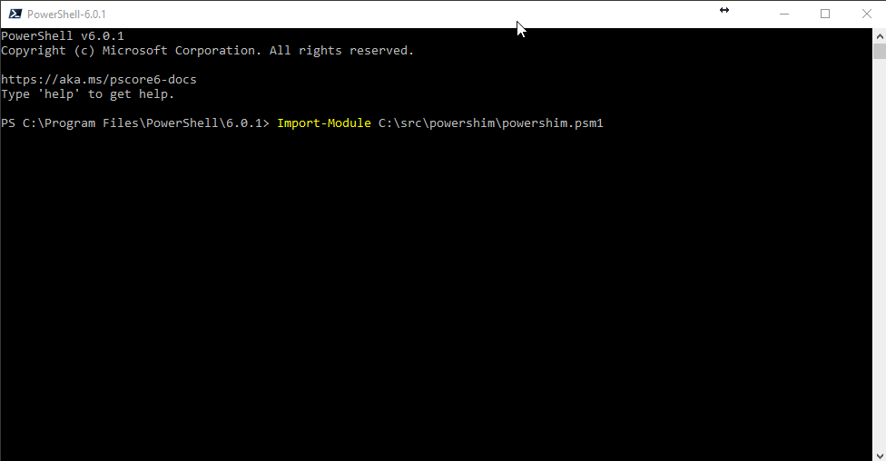

# PowerShim 

## Invoke Windows PowerShell from PowerShell Core

There are a lot of modules that do not yet support PowerShell Core. To work around this, you can use PowerShim to execute Windows PowerShell cmdlets and return the results to PowerShell Core. 

Thie module executes code in an out-of-proc Windows PowerShell instance and uses PowerShell Remoting to communicate with it from PowerShell Core. This uses the same protocol as Enter-PSHostProcess.

This isn't perfect. Some script blocks won't work but should allow you to call cmdlets you wouldn't normally be able to call in PowerShell Core.

Cmdlet return values are serialized over PowerShell remoting so you will have objects returned by Invoke-Shim.

## Give it a shot



```
PS> Import-Module PowerShim
PS> Get-SmbShare
PS> Invoke-Shim {
    Get-SmbShare
}
```

## An idea for the future

Import a Windows PowerShell module into PowerShell Core and generate function wrappers around Invoke-Shim to call into Windows PowerShell. 

```
Import-WindowsPowerShellModule Hyper-V 

$Vms = Get-VM 
```

The above would generate all the functions in the Hyper-V module like: 

```
function Get-VM {
    param(...)

    Invoke-Shim {
        Get-VM $args...
    } -ArgumentList @(...)
}
```


